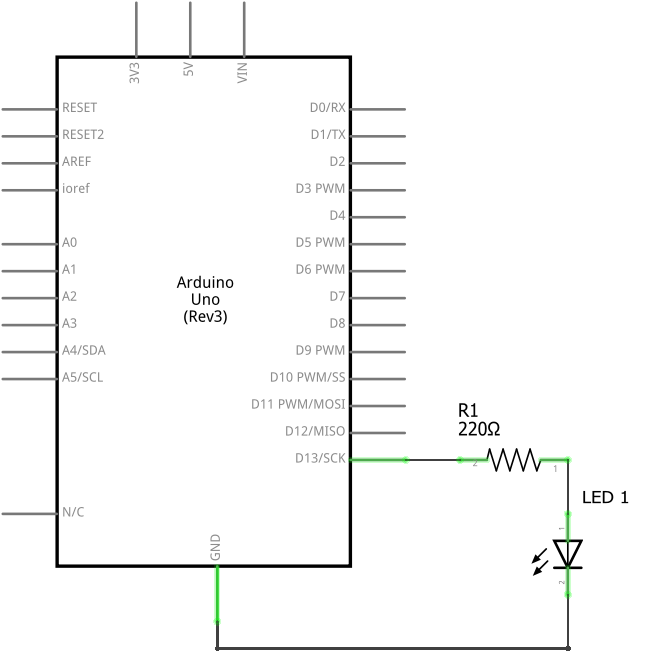

# Exercise 1

This exercise is the same as the previous one with the only difference that a led connected to pin 13 is used instead of using the built-in led.

## Schematic

<p align="center">
    </img>
</p>

## Code

```c
// the setup function runs once when you press reset or power the board
void setup()
{
    // initialize digital pin LED_BUILTIN as an output.
    pinMode(LED_BUILTIN, OUTPUT);
}

// the loop function runs over and over again forever
void loop()
{
    digitalWrite(LED_BUILTIN, HIGH);   // turn the LED on
    delay(1000);                       // wait for a second
    digitalWrite(LED_BUILTIN, LOW);    // turn the LED off
    delay(1000);                       // wait for a second
}
```
