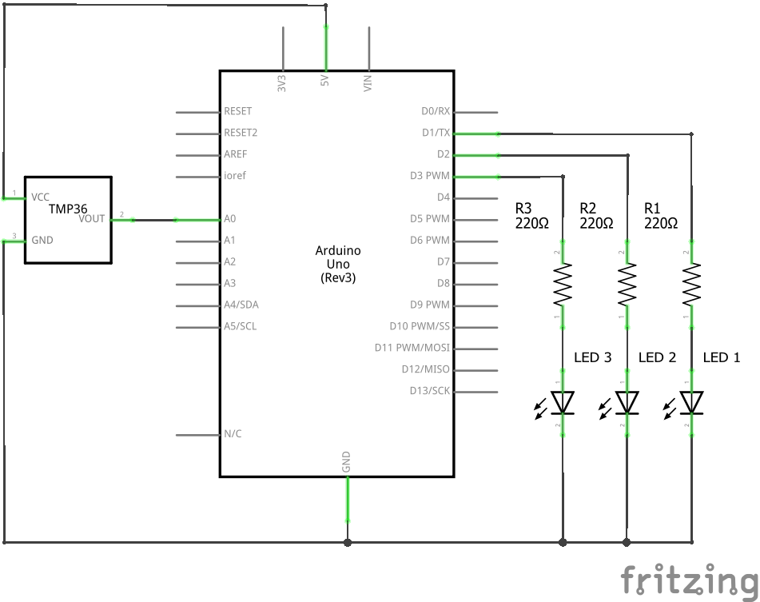

# Exercise 3

This exercise consists in measuring the environmental temperature using a TMP36 temperature sensor with Arduino. This sensor is able to measure a fairly wide range of temperature (-50°C to 125°C) with a pretty good resolution (0.1°C).

## Schematic

<p align="center">
    </img>
</p>

## Code

```c
// define constants
const int sensorPin = A0;
const float baselineTemp = 20.0;
const int pin1 = 2;
const int pin2 = 3;
const int pin3 = 4;

// initialisation
void setup()
{
    // open a serial connection
    Serial.begin(9600);

    // pin initialisation
    for(int pinNumber = pin1; pinNumber < pin3; pinNumber++)
    {
        pinMode(pinNumber, OUTPUT);
        digitalWrite(pinNumber, LOW);
    }
}

// main
void loop()
{
    // read the sensor value from ADC on AnalogIn pin 0
    int sensorVal = analogRead(sensorPin);

    // send the 10-bit sensor value out to the serial port
    Serial.print("Sensor value: ");
    Serial.print(sensorVal);

    // convert the ADC reading to voltage
    float voltage = (sensorVal/1024.0) * 5;

    // send the voltage level out to the serial port
    Serial.print(", Voltage: ");
    Serial.print(voltage);

    // convert voltage to temperature (500 mV offset)
    float temperature = (voltage - 0.5) * 100;

    // send the temperaure out to the serial port
    Serial.print(", Degrees in Celsius: ");
    Serial.println(temperature);

    if(temperature < baselineTemp)
    {
        // temperature less than 20°C
        digitalWrite(pin1, LOW);   // OFF
        digitalWrite(pin2, LOW);   // OFF
        digitalWrite(pin3, LOW);   // OFF
    }
    else if(temperature > baselineTemp + 2 &&
            temperature < baselineTemp + 8)
    {
        // temperature between 22°C and 28°C
        digitalWrite(pin1, HIGH);  // ON
        digitalWrite(pin2, LOW);   // OFF
        digitalWrite(pin3, LOW);   // OFF
    }
    else if(temperature > baselineTemp + 8 &&
            temperature < baselineTemp + 12)
    {
        // temperature between 28°C and 32°C
        digitalWrite(pin1, HIGH);  // ON
        digitalWrite(pin2, HIGH);  // ON
        digitalWrite(pin3, LOW);   // OFF
    }
    else if(temperature > baselineTemp + 12)
    {
        // temperature greater than 32°C
        digitalWrite(pin1, HIGH);  // ON
        digitalWrite(pin2, HIGH);  // ON
        digitalWrite(pin3, HIGH);  // ON
    }

    // wait 2s
    delay(2000);
}
```
